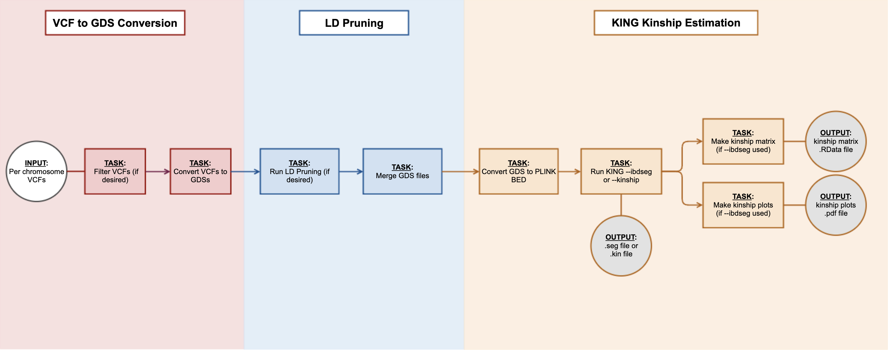

# KING

KING (Kinship-based Inference for GWAS) is a relationship inference tool that estimates kinship coefficients infers IBD segments for all pairwise relationships. Unrelated pairs can be precisely separated from close relatives with no false positives, with accuracy up to 3rd- or 4th-degree (depending on array or WGS) for --related and --ibdseg analyses, and up to 2nd-degree for --kinship analysis.

The KING workflow utilizes several WDLs to estimate kinship coefficients from VCF files. First, the input VCF files are converted to GDS files, which is the required input format for KING. The input VCF files should be one per chromosome with the name of the chromosome in the filename (ex: "chr1.vcf.gz") and only autosomes should be used. At least two samples should be in each VCF. These per chromosome VCFs are converted to per chromosome GDS files, and LD pruning can be done if desired at this stage. The per chromosome GDS files will then be merged and the merged GDS file will be used as input to KING. KING will run with the --ibdseg flag by default, which will analyze all IBD segments shared between individuals and infer the relationship between them. If the --ibdseg flag can not be successfully run, KING will automatically run again with the --kinship flag. This flag will estimate pairwise kinship coefficients using the KING-Robust algorithm.

Below is a flowchart that outlines the workflow step-by-step:

## KING Input Parameters

An example JSON file of inputs for running KING is provided in this repo. The input VCFs are ready and available for test purposes.

| Type        | Name                   | Required | Description | Default Value |
| :---------- | :--------------------- | :------: | :---------- | :------------ |
| Array[File] | input_vcfs             | Yes      | VCF files for IBD evaluation | |
| File        | input_bed              | No       | BED file with regions for filtering input VCFs | |
| File        | sample_include_file    | No       | RData file with vector of sample.id to use for LD pruning (unrelated samples are recommended) and to ensure that the output matrix includes all samples for later analysis; if not provided, all samples will be included | |
| File        | variant_include_file   | No       | RData file with vector of variant.id to include to consider for LD pruning; if not provided, all variants will be included | |
| File        | phenotype_file         | No       | RData file with AnnotatedDataFrame of phenotypes; Used for plotting kinship estimates separately by study | |
| String      | group                  | No       | | |
| Float       | kinship_plot_threshold | No       | | 0.04419417382 |
| Float       | sparse_threshold       | No       | Minimum kinship to use for creating the sparse matrix from king --ibdseg output | 0.02209709 |
| Boolean     | ld_pruning             | No       | Whether to do LD pruning step | false |
| Boolean     | check_gds              | No       | Whether to check the merged GDS file after LD pruning | false |
| Int         | memory                 | No       | Memory override for KING tasks | 4 |
| Int         | addldisk               | No       | Extra disk space (in GB) to add to the estimated amount for each KING task | 5 |
| String      | output_basename        | Yes      | Basename for all output files | |
| String      | king_docker_image      | No       | Docker image with KING software | "uwgac/topmed-master@sha256:0bb7f98d6b9182d4e4a6b82c98c04a244d766707875ddfd8a48005a9f5c5481e" |
| String      | bcftools_docker_image  | No       | Docker image with bcftools | "us-central1-docker.pkg.dev/mgb-lmm-gcp-infrast-1651079146/mgbpmbiofx/bcftools:1.17" |

## KING Output Parameters

| Type | Name          | When                   | Description |
| :--- | :------------ | :--------------------- | :---------- |
| File | ibdseg_matrix | If --ibseg completes   | Block-diagonal matrix of pairwise kinship estimates |
| File | ibdseg_plots  | If --ibseg completes   | Hexbin plots of estimated kinship coefficients |
| File | ibdseg_seg    | If --ibseg completes   | Pairwise kinship estimates for all sample pairs with any detected IBD segments |
| File | kin_file      | If --kinship completes | Kinship estimations for related samples |

## References

Original KING paper:
Manichaikul A, Mychaleckyj JC, Rich SS, Daly K, Sale M, Chen WM (2010) Robust relationship inference in genome-wide association studies. Bioinformatics 26(22):2867-2873

KING Tutorial: https://www.kingrelatedness.com/manual.shtml

Original KING Github: https://github.com/DataBiosphere/analysis_pipeline_WDL/tree/main
